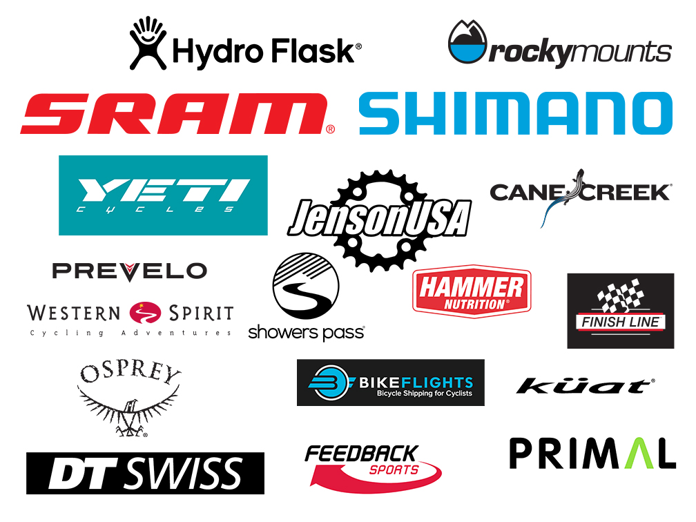

[SORBA's Fall Membership drive is ongoing until October 31st, 2020](https://www.imba.com/membership-drive-rules)

Join or renew your SORBA membership during the month of October and you are entered to win prize packs from IMBA and a bike from SORBA.

We have a stronger voice if we work together!. Please support local mountain biking by joining or renewing your membership.

It's trail work season! We will start having social distance friendly work parties at Walker Park this month to maintain the trails and start building the pump track. In addition we are working on agreements with private landowners to maintain existing trails and develop new trails on parcels along the Firefly Corridor, more details will be forthcoming this Fall.

More details about IMBA prize packs and official rules [HERE](https://www.imba.com/membership-drive-rules).

**Prize packs are made possible by these sponsors:**

