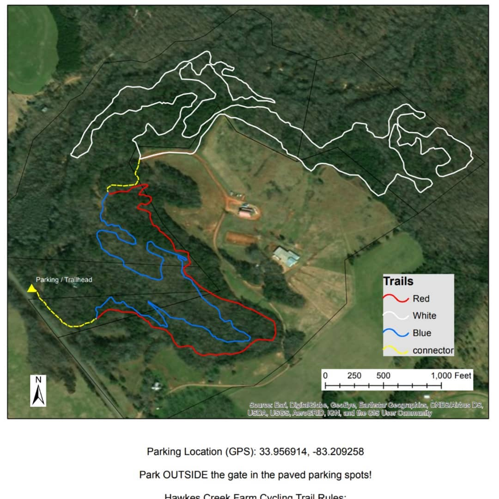

Hawkes Creek work day on Sunday November 24th 2019 at 9:30am. 

We will do some leaf blowing and raking and maybe some weed eating. Let me know if you are planning to be there. We will meet at the barn in back. Contact me on my cell: 706-338-0011.

[Directions to the barn](https://www.google.com/maps/dir//33.959399,+-83.204632/@33.9670456,-83.4322818,15z/data=!4m2!4m1!3e0)

