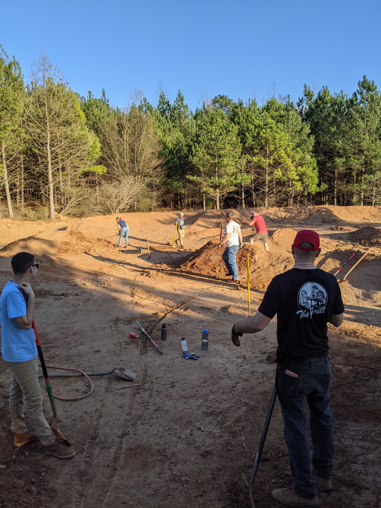

***Donate at the [Classy Campaign here](https://www.classy.org/fundraiser/3144109)***

***We need your help***, we have the opportunity to raise $32,000, from donations and matching funds. Your donated dollars will support the project, and if awarded, a matching grant from the Outride Fund will double your donations! 

The Pump Track at Walker Park is underway and we are fundraising for the next phases, which will include a skills course and bike library to help reduce bairers to entry for our sport locally!

Walker Park is located in District 2 in Athens-Clarke County.  District 2 is the only majority-minority district in Athens with a poverty rate for children above fifty percent. Walker Park is also located within walking distance from two affordable housing communities and an elementary school.  There are currently more than five miles of natural surface trails at Walker Park that are open to bikes, including two purpose built downhill mountain bike trails.

