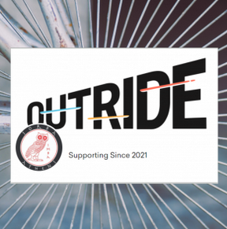
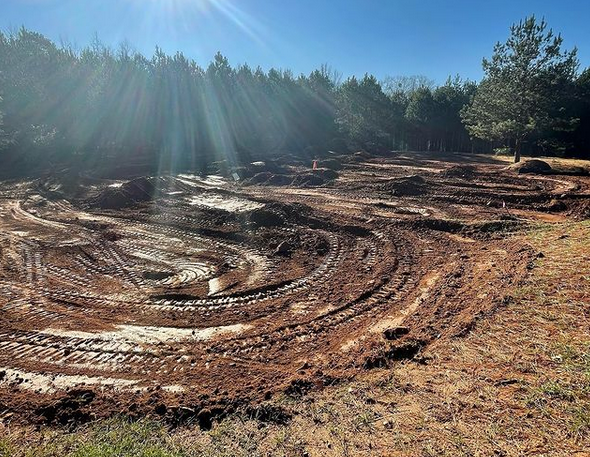

***Please support our active fundraiser with the potential to raise up $30,000 [Classy Campaign here](https://www.classy.org/fundraiser/3144109)***

<iframe width="560" height="315" src="https://www.youtube.com/embed/DGOqmrOYghA" title="YouTube video player" frameborder="0" allow="accelerometer; autoplay; clipboard-write; encrypted-media; gyroscope; picture-in-picture" allowfullscreen></iframe>

We are building a pump track at Walker Park in Athens, GA! It has taken us a long time to get here, but construction is underway! Thank you [Bandit Built, LLC](https://banditbuilt.com/) for making it happen despite all the challenges of 2020!

In addition to the Pump Track construction, we are also building a skills course at Walker Park! The course will include wooden features like skinnies, progressive drops, wall rides and other skill-building features. The primary goal of this new course is to allow space for children and other developing riders to practice and acquire skills in a more controlled setting, where they can gain the practice and confidence that they need to enjoy the pre-existing trails at Walker Park.  We are hoping to have the skills course built by Fall 2021!

The conceptual plan for the pump track site includes pump track space for beginners up to experts as well as space to hang out and enjoy the show. The final product won't look exactly like the drawing, but it gives us an idea of the final goal.

# 
This project would not be possible without the support of the community, supporting organizations and our local government. We will be copleting the work with a combination of expert contractors and volunteer labor, there will be plenty of opportunities to contribute, keep an eye out for upcoming events.

## **Pump track wish list** - if you have something to contribute please [contact us](mailto:sorbaathens@gmail.com) first

+ Connex container for tool storage
+ Treated lumber for skills features
+ Rot resistant natural wood (Locust, etc.) for skills features
+ Benches
+ Shade tents
+ Picnic tables

## Pump Track Supporters

+ [The Give Thanks Foundation](https://www.facebook.com/GiveThanks8k/) - this project would not be possible without the efforts of this great local organization. If you participated in one of the annual GiveThanks races in the last three years you have supported this project and we appreciate your contribution!
+ [Bandit Built, LLC](https://banditbuilt.com/) is an Athens based trail building company serving as the general contractor for the Walker Park Pump track.
+ [Athens Clarke County Leisure Services](https://www.athensclarkecounty.com/148/Leisure-Services) - this project would not be possible without the cooperative agreements between SORBA Athens and ACC Leisure Services.
+ [New Urban Forestry](https://newurbanforestry.com/) - a great local company that has gone above and beyond to help get this project where it is today.
+ Each contributor to the [Classy Campaign](https://www.classy.org/fundraiser/3144109)
+ All the volunteers, and too many others to name
