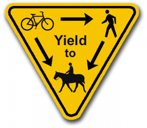
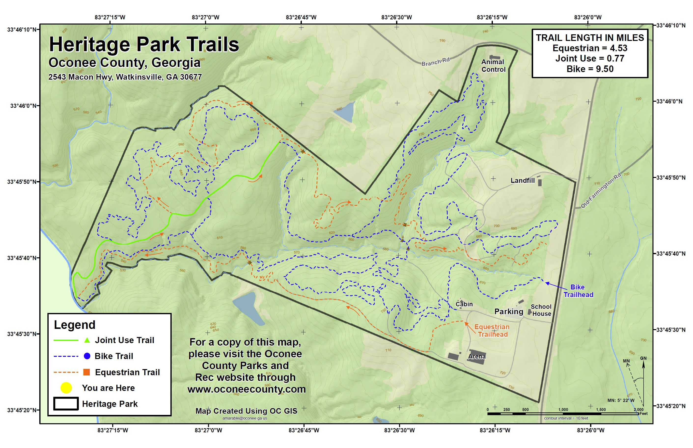

## Wet trails

+ Please DO NOT ride wet trails and ALWAYS follow IMBA's Rules of the Trail

Links to official Trail Status pages are provided if available. If there is no Trail Status link for a trail, you can check recent rainfall amounts using the [National Weather Service Precipitation Map](https://water.weather.gov/precip/)

## Trail Creek Park (Athens, GA) 
+ [Trail Map](https://drive.google.com/file/d/0Bw-7LsEhsXR8N0UtQTRLdUZmVVE/view?pli=1)
+ [Trail Fork (Map and Status)](https://www.trailforks.com/region/trail-creek-park-21762/)
+ [Hourly Precipitation Map](https://water.weather.gov/precip/index.php?analysis_date=1572912000&lat=33.9666784496&location_name=CONUS_%20_Puerto_Rico&location_type=us&lon=-83.3575318762&precip_layer=0.75&product=observed&recent_type=today&rfc_layer=-1&state_layer=-1&hsa_layer=-1&county_layer=-1&time_frame=1day&time_type=recent&units=eng&zoom=15&domain=current)
+ [Directions](https://www.google.com/maps/dir//33.9676497,-83.3553771/@33.9668267,-83.3588855,17z)

----------------

**Trail Creek Park** offers just under 5 miles of trails which include beginner, intermediate and advanced trails and offers something for all skill levels.

There are 5 primary trails at Trail Creek:

+ **Green (green)** is beginner friendly and a great introduction to mountain biking.
+ **Orange Crush (orange)** is beginner/intermediate with dips and berms including a fun bermy ravine called **Sidewinder**.
+ **Drive-By Truckers (blue)** is beginner/intermediate with dips, berms, rollers and rock features as well as a short optional downhill section called **3 Dimes Down**. 
+ **Panic (yellow)** is beginner/intermediate with a downhill only section with lots of tight berms, a couple of optional jumps, and an optional rock drop that ends at the shoals near the bridge. 
+ **Widespread (red)** is intermediate/advanced downhill only trail with huge berms and jumps. Widespread is for mountain bikes only.  No pedestrian traffic is allowed.
+ To be built -- **Comeback Sauce** soon we will begin construction of a return trail from the bottom of Widespread/Panic back to the top without crossing the road, keep an eye out for volunteer opportunitites.

* * *

## UGA Intramural Fields/Lake Herrick (Athens, GA) 

+ [GPS Coordinates/Driving Directions](https://www.google.com/maps/place/33%C2%B055'41.7%22N+83%C2%B022'34.3%22W/@33.928239,-83.3783787,17z/data=!3m1!4b1!4m5!3m4!1s0x0:0x0!8m2!3d33.928239!4d-83.37619?hl=en)

1.2 miles of beginner trails.  Open sunrise to sunset.  Hikers and dog walkers share this trail and are usually present in great numbers.  Bikes are not allowed on some sections, look for the "No Bikes" symbol and respect them.

## Hawkes Creek Farm (Winterville, GA): Multiuse yield to horses!

+ [Trail Map](https://drive.google.com/file/d/1ZUz817ZOQIvA1hdKX4U_8H_GXrYOdRh3/view)
+ [GPS Coordinates/Driving Directions](https://www.google.com/maps/place/33%C2%B057'24.9%22N+83%C2%B012'33.3%22W/@33.956914,-83.2114467,17z/data=!3m1!4b1!4m5!3m4!1s0x0:0x0!8m2!3d33.956914!4d-83.209258?hl=en)
+ [Website](http://www.hawkescreekfarm.com/site/bikes-at-hawkes-creek-farm/the-trails)

4.8 miles (Intermediate / Advanced). This trail system is on the wooded edges of a horse farm, please stay on the trail. There may be horse on the trail, if you encounter horses please remember bikes yield to horses. We ride with the owner's permission and follow their rules, please be respectful. These trails need more traffic to keep the leaves at bay, please go ride them if you can! Contact Jay Tibbett if you would like to help with trail maintenance.

 Please remember on multiuse trails bikes yield to horses and pedestrians.

## Heritage Park (Watkinsville, GA): Multiuse yield to horses!

+ [Trail Map](http://www.oconeecounty.com/DocumentCenter/View/537)
+ [GPS Coordinates/Driving Directions](http://maps.google.com/maps?q=33.759125,-83.436747&hl=en&sll=33.759495,-83.436184&sspn=0.002743,0.00368&vpsrc=0&t=m&z=13)
+ [Website](http://www.oconeecounty.com/Facilities/Facility/Details/Heritage-Park-8)
+ [Trail Fork (Map and Status)](https://www.trailforks.com/region/heritage-park-1517182130/)

### Right of way for multiuse trails
 on multiuse trails bikes yield to horses and pedestrians. Being curteous to other users helps our community preserve and increase our access to trails.

10 miles (Intermediate / Advanced). Open sunrise to sunset. There are separate trail sections for bikes and horses.  When the trails are officially closed by Oconee County there will be an announcement posted on the Trail Status Link above.  Heritage is a challenging old school trail with some tight twisty singletrack, challenging climbs, fast downhills, and technical sections with roots and rocks.

## To find trails farther away from Athens see MTB Project or Trail Forks

<!-- BEGIN MTB Project -->
<iframe style="width:100%; max-width:1200px; height:500px;" frameborder="0" scrolling="no" src="https://www.mtbproject.com/widget/map?favs=1&location=fixed&x=-9281486&y=4103408&z=7&h=500"></iframe>
<!-- END MTB Project -->

<!-- TRAILFORKS WIDGET START -->

<a href="https://www.trailforks.com/region/southeast-8395/">Southeast</a> on <a href="https://www.trailforks.com/">Trailforks.com</a>

<!-- TRAILFORKS WIDGET END -->
