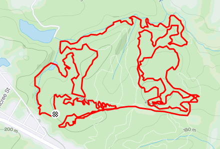

* * *

+ [Hart Farms on Facebook](https://www.facebook.com/hartfarmtrails)
+ [Trail Map coming soon]()
+ [GPS Coordinates/Driving Directions](https://www.google.com/maps/dir/Athens,+Georgia/53+Crawfordville+Rd,+Union+Point,+GA+30669/@33.7633982,-83.5163775,10z/data=!3m1!4b1!4m14!4m13!1m5!1m1!1s0x88f66d19b4b433b9:0x4d747202d69d617c!2m2!1d-83.357567!2d33.9519347!1m5!1m1!1s0x88f657c29ff0be1d:0xb39cb7d6f423a236!2m2!1d-83.0575695!2d33.6143922!3e0)
+ [Website](https://www.hartcorrytrails.com/)

This trail system consists of hand-cut single track that bisects a power line easement. Trails pop in and out of the woods and you are never far from the trail head, which has a covered picnic area, camper restroom and a bike wash station. The trails have a little bit of everything that comes with hand cut single track in an old hardwood growth forest.... roots, rocks, twisty turns, short punchy climbs, sweeping descents, creek crossing and a little bit of double track thrown in for good measure.

Please support the Hart Farms trails by riding them and making a small donation to help pay the annual lease. There is a donation box at the trail head or you can donate to our [Paypal](https://www.paypal.com/donate?token=Wbs_Z565NoZL3nNSpUrZQVVOsnR1fuQ3tTKyvh7G4xcBplrQAVaMwi9tBMbWO-O0txFpG7PsiRrhzRnC) and designate to "Use this donation for" Hart Farms Trails.

