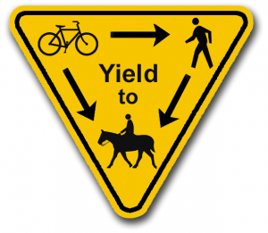
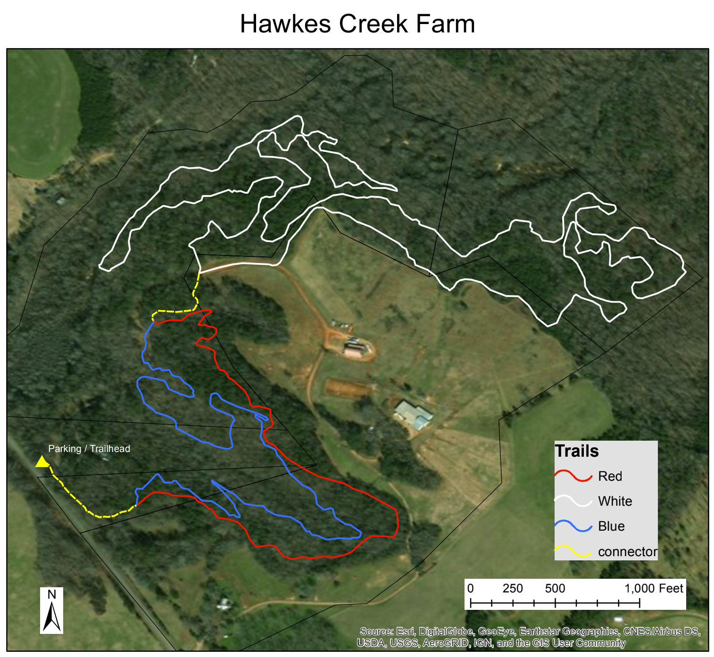

+ [Trail Map](https://drive.google.com/file/d/1ZUz817ZOQIvA1hdKX4U_8H_GXrYOdRh3/view)
+ [GPS Coordinates/Driving Directions](https://www.google.com/maps/place/33%C2%B057'24.9%22N+83%C2%B012'33.3%22W/@33.956914,-83.2114467,17z/data=!3m1!4b1!4m5!3m4!1s0x0:0x0!8m2!3d33.956914!4d-83.209258?hl=en)
+ [Website](http://www.hawkescreekfarm.com/site/bikes-at-hawkes-creek-farm/the-trails)

4.8 miles (Intermediate / Advanced). This trail system is on the wooded edges of a horse farm, please stay on the trail. There may be horse on the trail, if you encounter horses please remember bikes yield to horses. We ride with the owner's permission and follow their rules, please be respectful. These trails need more traffic to keep the leaves at bay, please go ride them if you can! Contact Jay Tibbett if you would like to help with trail maintenance.

 **Please remember on multiuse trails bikes yield to horses and pedestrians!**

