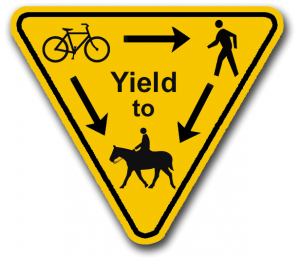

+ [Trail Map](http://www.oconeecounty.com/DocumentCenter/View/537)
+ [Trail Forks Map](https://www.trailforks.com/region/heritage-park-1517182130/)
+ [Daily Precipitation Map](https://water.weather.gov/precip/index.php?analysis_date=1576627200&lat=33.7607928240&location_name=CONUS_%20_Puerto_Rico&location_type=us&lon=-83.4478920746&precip_layer=0.75&product=observed&recent_type=yesterday&rfc_layer=-1&state_layer=-1&hsa_layer=-1&county_layer=-1&time_frame=1day&time_type=recent&units=eng&zoom=14&domain=current)
+ [GPS Coordinates/Driving Directions](http://maps.google.com/maps?q=33.759125,-83.436747&hl=en&sll=33.759495,-83.436184&sspn=0.002743,0.00368&vpsrc=0&t=m&z=13)
+ [Website](http://www.oconeecounty.com/Facilities/Facility/Details/Heritage-Park-8)

### Right of way for multiuse trails
 on multiuse trails bikes yield to horses and pedestrians. Being curteous to other users helps our community preserve and increase our access to trails.

10 miles (Intermediate / Advanced). Open sunrise to sunset. There are separate trail sections for bikes and horses.  When the trails are officially closed by Oconee County there will be an announcement posted on the Trail Status Link above.  Heritage is a challenging old school trail with some tight twisty singletrack, challenging climbs, fast downhills, and technical sections with roots and rocks.
