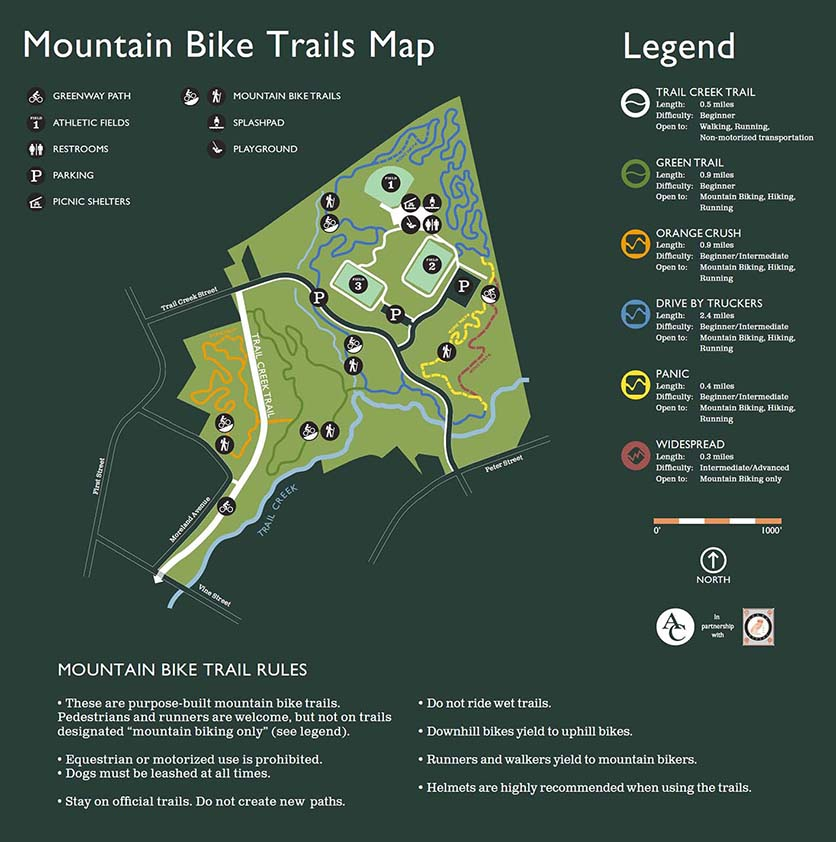

+ [Trail Map](https://drive.google.com/file/d/0Bw-7LsEhsXR8N0UtQTRLdUZmVVE/view?pli=1)
+ [Trail Forks Map](https://www.trailforks.com/region/trail-creek-park-21762/)
+ [Daily Precipitation Map](https://water.weather.gov/precip/index.php?analysis_date=1576627200&lat=33.9666784496&location_name=CONUS_%20_Puerto_Rico&location_type=us&lon=-83.3575318762&precip_layer=0.75&product=observed&recent_type=yesterday&rfc_layer=-1&state_layer=-1&hsa_layer=-1&county_layer=-1&time_frame=1day&time_type=recent&units=eng&zoom=15&domain=current) - if the previous 24 hr precipitation exceeds 0.5 inches you should not ride the trails. More details to come.
+ [Directions](https://www.google.com/maps/dir//33.9676497,-83.3553771/@33.9668267,-83.3588855,17z)

**Trail Creek Park** offers just under 5 miles of trails which include beginner, intermediate and advanced trails and offers something for all skill levels. This winter we will begin construction of a [pump track](/pump-track/) at Trail Creek Park.

**There are 5 trails at Trail Creek**:

+ **Green (green)** is beginner friendly and a great introduction to mountain biking.
+ **Orange Crush (orange)** is beginner/intermediate with dips and berms including a fun bermy ravine called **Sidewinder**.
+ **Drive-By Truckers (blue)** is beginner/intermediate with dips, berms, rollers and rock features as well as a short optional downhill section called **3 Dimes Down**. 
+ **Panic (yellow)** is beginner/intermediate with a downhill only section with lots of tight berms, a couple of optional jumps, and an optional rock drop that ends at the shoals near the bridge. 
+ **Widespread (red)** is intermediate/advanced downhill only trail with huge berms and jumps. Widespread is for mountain bikes only.  No pedestrian traffic is allowed.
+ Under construction - **Comeback Sauce** will be a return trail from the bottom of Widespread/Panic back to the top without crossing the road, keep an eye out for volunteer opportunitites.

