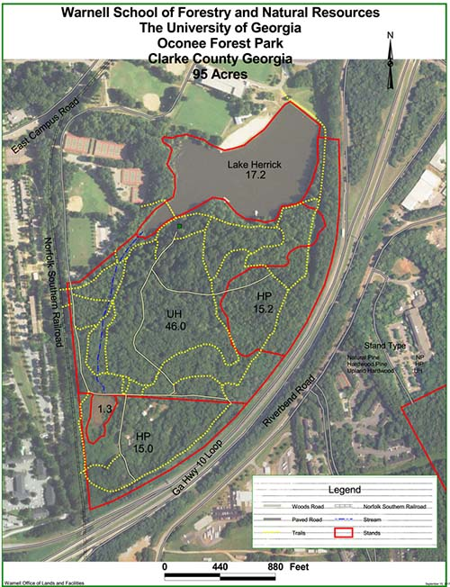

+ [UGA Website](https://www.warnell.uga.edu/oconee-forest-park)
+ [GPS Coordinates/Driving Directions](https://www.google.com/maps/place/33%C2%B055'41.7%22N+83%C2%B022'34.3%22W/@33.928239,-83.3783787,17z/data=!3m1!4b1!4m5!3m4!1s0x0:0x0!8m2!3d33.928239!4d-83.37619?hl=en)

1.2 miles of beginner trails.  Open sunrise to sunset.  Hikers and dog walkers share this trail and are usually present in great numbers.  Bikes are not allowed on some sections, look for the "No Bikes" symbol and respect them.

